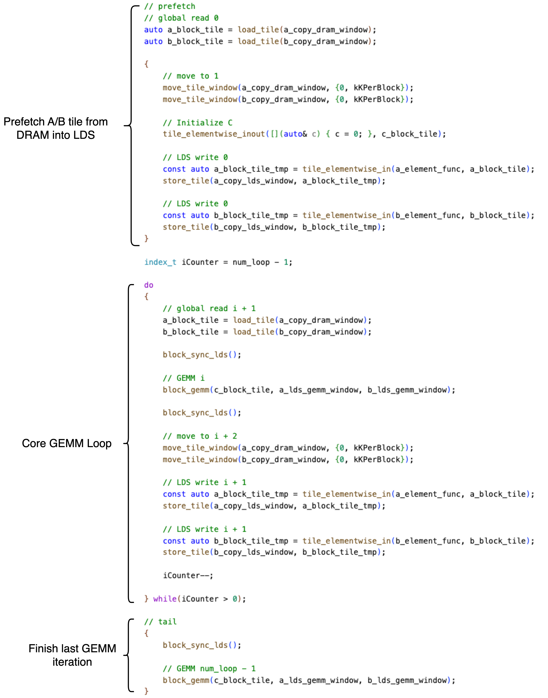
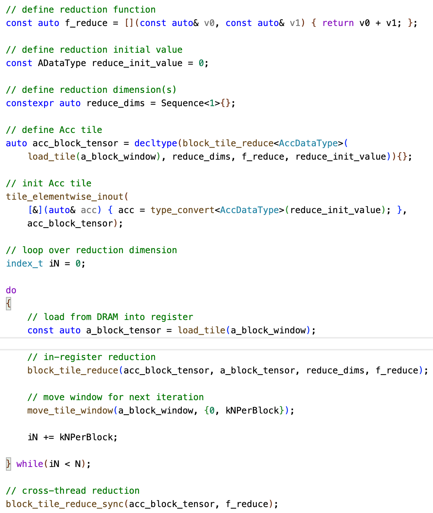
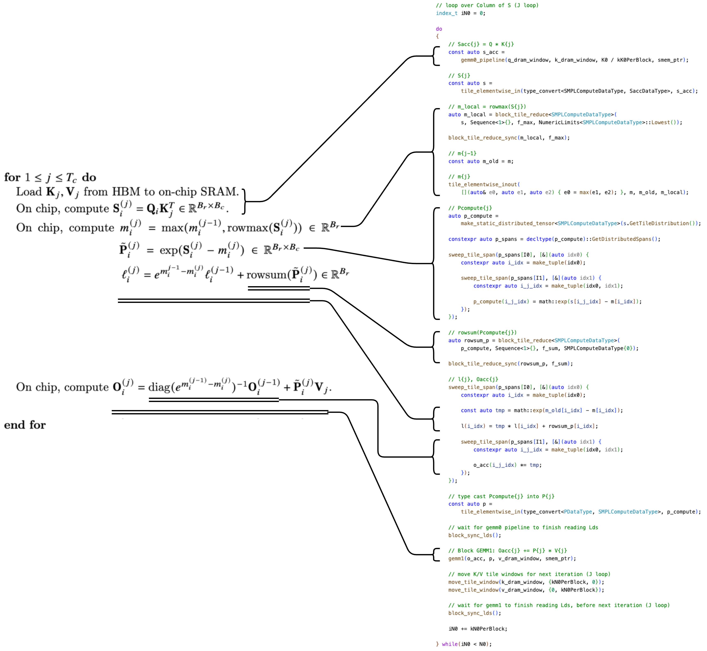

# CK Tile Programming Interface

## Data Structure

### ```TensorView```

```TensorView``` describes the tensor layout in memory (DRAM, LDS).  ```TensorView``` support two kinds of tensor data structure.

1. ```TensorView``` can describe simple data structure like multi-dimensional array.

```c++
// make a packed tensor view
tensor_view = make_naive_tensor_view_packed(ptr, lengths, min_vector_length)

// make a strided tensor view
tensor_view = make_naive_tensor_view(ptr, lengths, strides, min_vector_length, last_strides)
```

2. With CK's **Coordinate Transformation Primitives**, ```TensorView``` can remap tensor data into more complicated data structured. This is advanced usage of ```TensorView```, which is described here (link-xxx)

```c++
// transform a tensor view
transformed_tensor_view = transform_tensor_view(original_tensor_view, transform, original_dims, transformed_dims)
```


### ```Window```

```Window``` is the iterator of ```TensorView```. It gives read and write data movement of data in ```TensorView```. You can also move a ```Window``` in tensor space.

```c++
// make a window
// TODO: rename code
window = make_window(tensor_view, window_lengths, origins)

// make a window with distribution
// TODO: rename code
window = make_window(tensor_view, window_lengths, origins, tile_distribution)
```

```c++
// move a window
// TODO: rename code
move_window(window, step)
```


### ```DistributedTensor```

```DistributedTensor``` is the container of a tile of tensor data, owned by the a warp, a thread block, or a block cluster, but distriubutedly held by each thread in its private memory (register).  

```c++
// TODO: rename code
distributed_tensor = make_distributed_tensor<DataType>(tile_distribution)
```


### ```TileDistribution```

```TileDistribution``` describes how tile data are distributed among each thread.


## Tile Tensor Operators

### Data Movement

```load```

```c++
distributed_tensor = load(window)
```

```store```

```c++
store(window, distributed_tensor)
```

```copy```

```c++
copy(destination_window, source_window)
```

### GEMM

```c++
// c = a * b
c = gemm(a, b)

// c += a * b
gemm(c, a, b)
```
```a```, ```b```, ```c``` could be either ```Window``` or ```DistributedTensor``` of a warp, or a thread block.

### Reduction

```c++
// reduce a warp tensor
y = reduce(x, reduce_dims, reduce_function)

// reduce a block tensor
y = reduce(x, reduce_dims, reduce_function, [block_ptr])
```


```c++
// Reduction inside a thread
y = reduce_in_thread(x, reduce_dims, reduce_function)

// Sync reduction result inside a warp
reduce_sync_warp(y, reduce_function)

// Sync reduction result inside a thread-block
reduce_sync_block(y, reduce_function, [block_ptr])
```

### Element-wise

```c++
// y = func(x0, x1, ...)
y = elementwise_in(func, x0, x1, ...)

// func(x0, x1, ..., y0, y1, ...)
elementwise_inout(func, x0, x1, ..., y0, y1, ...)
```

### Shuffle

```c++
// shuffle warp tensor
shuffle(y, x)
```

```c++
// shuffle block tensor
shuffle(y, x, [block_ptr])
```


### Sweep

```sweep``` let you iterate over a dimension of a ```DistributedTensor```. It's useful for building with nested loop logic with complex indexing across multiple ```DistributedTensor(s)```

```c++
sweep_span(distributed_tensor.GetSpan<0>(), [&](auto i) {...})
```


# Examples
## Block GEMM Pipeline




## Reduction 2-D Tensor into 1-D




## FlashAttention-2 (The Naive CK Tile Implementation)


